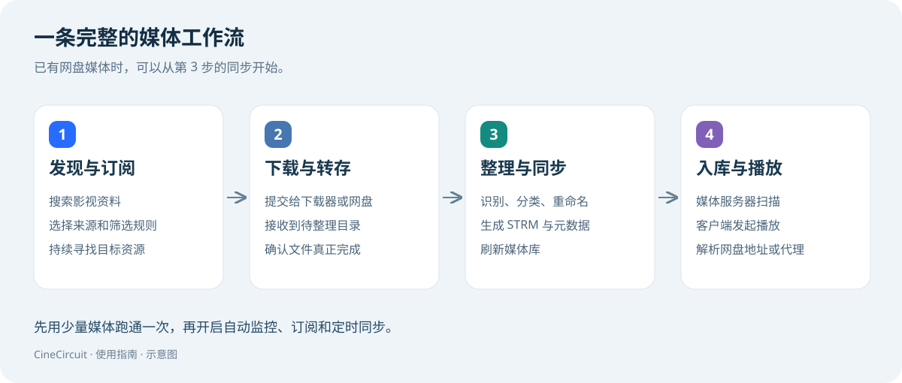

# CineCircuit 使用指南

**从连接网盘到自动入库，一步步搭建自己的媒体工作流。**

CineCircuit 是面向自建媒体库的自动化管理工具，将影视发现、资源订阅、下载与转存、媒体整理、元数据生成、STRM 同步和播放服务连接起来。

## 从这里开始

| 你想做什么 | 阅读文档 |
| --- | --- |
| 先了解能做什么 | [功能概览](wiki/01-features.md) |
| 首次安装、创建管理员 | [部署与初始化](wiki/02-installation.md) |
| 配置访问地址、刮削、命名规则 | [基础配置](wiki/03-configuration.md) |
| 连接本地目录或网盘 | [存储与账号](wiki/04-storage.md) |
| 连接站点与下载器 | [站点与下载器](wiki/05-sources-downloaders.md) |
| 搜索影视、自动追剧 | [搜索与订阅](wiki/06-subscriptions.md) |
| 整理文件、生成 STRM | [整理与同步](wiki/07-organize-sync.md) |
| 接入媒体服务器并播放 | [媒体服务器与播放](wiki/08-playback.md) |
| 安装插件、通知与日常维护 | [插件与运行管理](wiki/09-operations.md) |
| 配置不生效、任务失败、无法播放 | [常见问题](wiki/10-faq.md) |
| 了解使用责任、许可与风险 | [许可说明与免责声明](wiki/11-disclaimer.md) |

## 第一次使用，建议走这条路线

1. 部署应用，创建管理员。
2. 配好刮削服务和 STRM 直连地址。
3. 连接一个存储账号，确认可以浏览目录。
4. 选择少量有权使用的媒体文件，跑通整理、同步和播放。
5. 再连接资源来源与下载器，开启自动订阅。

已有网盘媒体库的用户，可以先跳过站点、下载器与订阅配置，直接阅读存储、同步和播放章节。

## 文档与图片说明

- 本版依据 **2026-09-15 的项目代码**编写，核对版本为 `e8f6913`。不同版本的字段和入口可能略有差异。
- 界面图片由当前前端实际渲染，使用独立演示数据，右下角带有“Wiki 演示”标识。图片展示配置位置，不代表真实账号已连接或任务已执行成功。
- 文档内的域名、IP、目录和影视名称都是示例，使用时应替换。
- 本仓库维护 CineCircuit 的公开使用文档，包含 Markdown 和配图；阅读不依赖私有源码仓库。

## 许可说明与免责声明

CineCircuit 用于自建媒体库管理与流程自动化。本项目不提供影视内容，也不授予访问、下载、复制、传播第三方内容的权利。使用前请阅读[完整许可说明与免责声明](wiki/11-disclaimer.md)。

- **合法使用与账号授权：**使用者应具备相应内容与账号的使用权限，遵守适用法律及相关服务条款。软件功能不替代会员、付费服务或内容授权，也不构成绕过访问控制的许可。
- **数据来源与第三方服务：**媒体、字幕、元数据、图片和播放地址可能来自使用者配置的存储与第三方服务；其合法性、准确性、完整性和持续可用性需按实际来源核实。接口、账号权益和服务规则变化可能导致功能中断。
- **自动化与数据风险：**下载、移动、重命名、覆盖、删除、回收站清理、同步和元数据修改可能改变或丢失数据，并消耗带宽、空间与付费额度。启用前应核对配置，先用少量文件验证，并保留可恢复的备份。
- **第三方插件与凭据：**插件可能在服务器进程及浏览器页面中执行代码。权限清单不等于独立沙箱；安装前应核实来源，妥善保护密码、Cookie、令牌、日志和备份。
- **担保、责任与许可：**除适用法律要求或另有有效书面约定外，软件按“原样”和“可用状态”提供，不保证无错误、不中断或符合特定需求。责任限制以适用法律和各组件许可证为准，不排除依法不得排除的责任。插件仓库自有代码的 GPL-3.0-only 许可及第三方组件各自的许可继续有效，本声明不增加与其冲突的使用、修改或分发限制。
