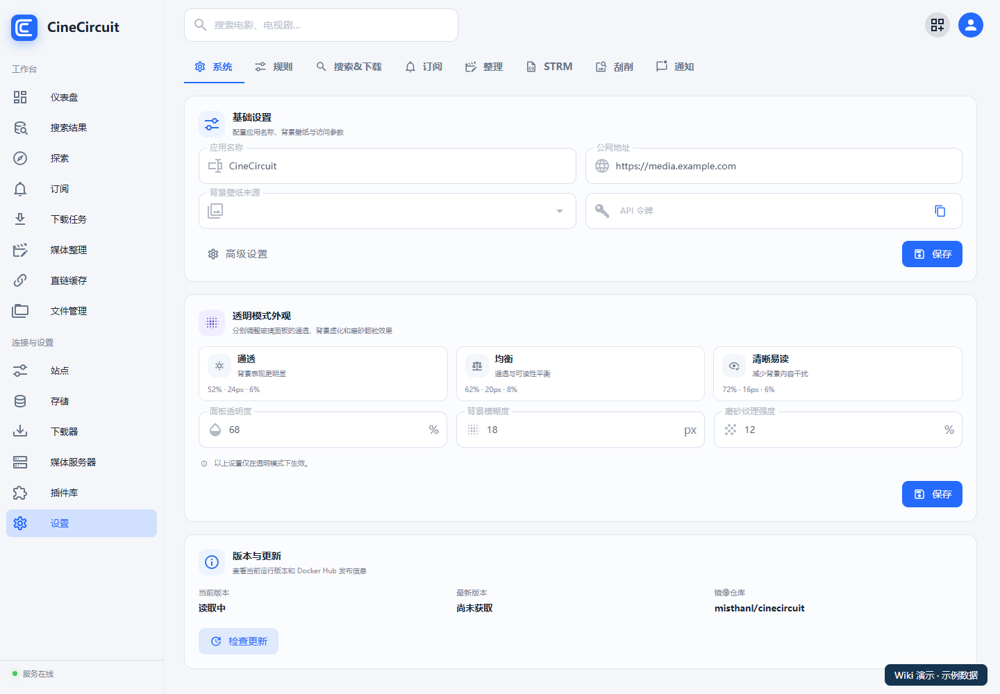
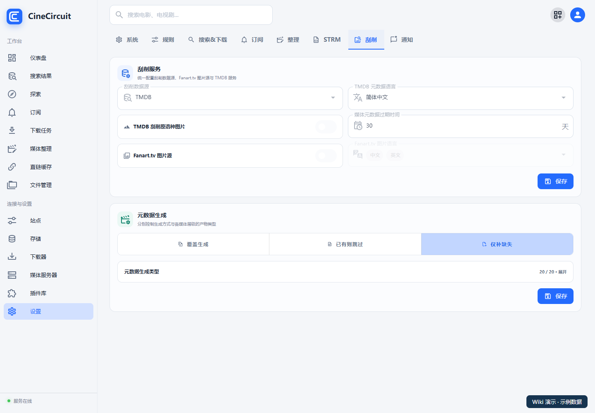
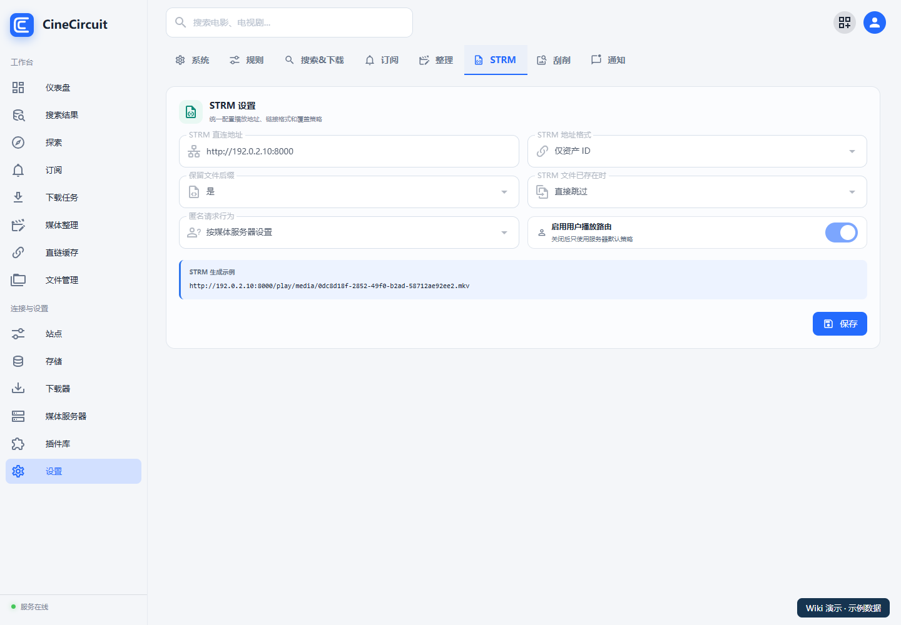

# 基础配置

[返回首页](../README.md)

首次使用建议先设置访问地址和刮削服务。规则、订阅和自动化可以在跑通一次手动流程后再调整。

## 1. 系统名称与访问地址

打开“**设置 → 系统**”。

| 字段 | 怎么填 |
| --- | --- |
| 应用名称 | 自定义显示名称，例如 `CineCircuit` |
| 公网地址 | 有外网入口时填写实际访问地址，例如 `https://media.example.com` |
| 背景壁纸来源 | 按偏好与已提供的来源选择 |
| API 令牌 | 用于相应 API 接入，不要作为普通展示内容公开 |

修改后点击该区域的“**保存**”。设置页有多个分区，保存时留意按钮所属的区域。

## 2. 配置刮削

打开“**设置 → 刮削**”。

1. 选择刮削数据源。
2. 中文媒体库通常选择“**TMDB 元数据语言：简体中文**”。
3. 在对应服务字段中填写自己可用的 API 凭据；不同来源的字段随接入实现展示。
4. 按需选择 Fanart.tv 图片源和图片语言。
5. 保存刮削服务配置。
6. 在元数据生成区域选择需要的 NFO、海报、背景图、季与单集资料，并保存。

**怎么选生成策略：**已有完整海报与 NFO 时，可先使用补齐缺失的策略；希望统一重新生成时，再检查覆盖策略后执行。生成类型和覆盖策略共同决定实际写入哪些文件。

刮削失败时，先确认应用所在服务器能访问数据源。电脑浏览器能打开网站，不代表容器到同一服务的网络可用。

## 3. 设置 STRM 播放地址

打开“**设置 → STRM**”。

| 字段 | 配置方法 |
| --- | --- |
| STRM 直连地址 | 填 CineCircuit 的实际可访问地址，例如内网 `http://NAS地址:8000` |
| STRM 地址格式 | “仅资产 ID”或“资产 ID + 影视名称”，按个人需要选择 |
| 保留文件后缀 | 控制生成地址的形式，不改变原视频格式 |
| STRM 文件已存在时 | 选择覆盖生成或直接跳过 |
| 匿名请求行为 | 按媒体服务器设置，或一律拒绝 |
| 启用用户播放路由 | 需要按用户选择播放策略时启用；还要配置媒体服务器对应策略 |

看下方“**STRM 生成示例**”确认地址格式，保存后再生成 STRM。

这里填的是 CineCircuit 播放入口，不能填成网盘官网地址。应由实际发起播放请求的设备或媒体服务器访问到；跨设备访问时不要填写 `localhost` 或 `127.0.0.1`。

修改地址后，已存在 STRM 可能仍保存旧地址。需要结合“覆盖生成”策略重新同步相关目录。

## 4. 配置分类与重命名

打开“**设置 → 整理**”，设置电影、电视剧分类与重命名规则。首次使用先保留默认规则，用少量文件验证识别与命名结果。

“**设置 → 规则**”管理资源筛选与优先级规则；“**设置 → 整理**”管理文件整理规则，两者用途不同：前者决定选哪个资源，后者决定文件如何入库。

## 5. 按需设置网络与通知

通过设置内的高级入口检查代理等网络配置；只有确实需要经过代理的服务才选择相应配置。通知在“**设置 → 通知**”中配置，详见[运行管理](09-operations.md)。

**下一步：[存储与账号](04-storage.md)。**
