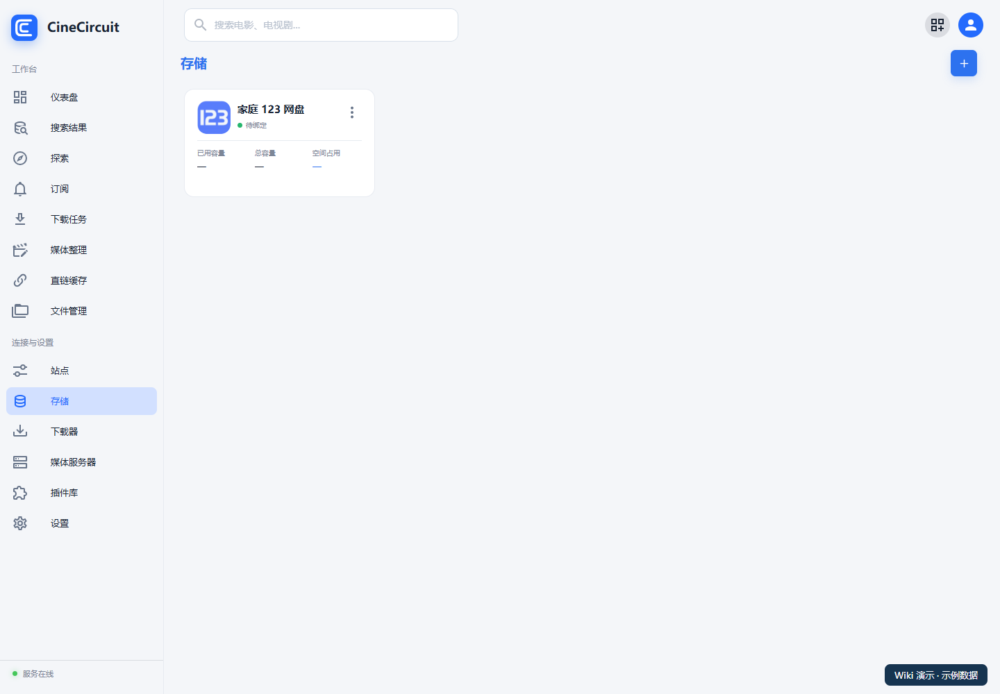
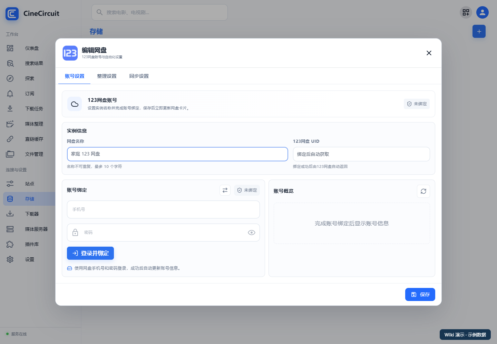

# 存储与账号

[返回首页](../README.md)

## 1. 添加存储

1. 打开侧栏“**存储**”。
2. 点击右上角添加按钮，选择网盘类型。
3. 填写便于辨认的名称，完成对应认证并保存。
4. 某些操作要求实例先保存；如果按钮不可用，先保存，再打开该账号。
5. 到“**文件管理**”中选择该存储，确认能打开目录。

列表显示账号状态和容量。演示图中的账号尚未绑定，容量显示为“—”；这不是实际在线状态示例。

## 2. 各网盘如何登录

| 网盘 | 当前登录方式 | 使用提示 |
| --- | --- | --- |
| 115 | 在账号设置中按页面提供的扫码/授权流程绑定 | 部分自动化使用 115 生活事件能力 |
| 123 | 手机号和密码；也可切换开放平台登录 | Open 可填 Client ID、Client Secret，或手动 Access Token |
| 光鸭 | 生成二维码后使用 APP 确认 | 授权完成后再查看账号与目录 |
| 夸克 | 扫码；也可切换 Open 接口登录 | Open 页面包含 AppID、SignKey、Access Token、Refresh Token |

以 123 的手机号密码登录为例：

1. 打开已添加账号的“**账号设置**”。
2. 填入手机号和密码。
3. 点击“**登录并绑定**”。
4. 确认账号信息与预期相符，保存配置。

密码等字段保存后可能不回显原值，不要因为看到空白或掩码就随意覆盖。需要换账号时，创建单独存储实例，避免混淆已有目录映射。

### 夸克 TV 播放授权

已经完成普通账号绑定后，可点击“**账号绑定**”右侧的电视图标，按弹窗扫码完成 TV 播放授权。该授权用于 TV 播放链接，普通登录/Open 配置继续负责各自文件操作。

播放画质以网盘提供的版本为准。授权失效后重新扫码。夸克 Open 的 Access Token 过期时需要手动更新；Refresh Token 当前仅保存，不应假设能自动续期。Open 模式的容量查询、分享转存有限制，分享转存使用扫码模式；夸克当前不提供离线下载及播放池接入。

## 3. 本地目录怎么配置

配置本地存储时，填写 **CineCircuit 容器内可见的路径**。例如宿主机把 `/srv/cinecircuit/media` 挂载到容器 `/media`，应用中应使用 `/media` 下的目录。

推荐先规划好三个角色：

| 角色 | 示例 | 用途 |
| --- | --- | --- |
| 下载/待整理目录 | 本地 `/media/downloads` 或网盘 `/待整理` | 接收原始资源 |
| 整理后的媒体目录 | 网盘 `/媒体库` 或本地媒体目录 | 保存识别、分类后的原媒体 |
| STRM 输出目录 | 本地 `/media/strm` | 保存媒体服务器要扫描的链接文件和相关资料 |

这些名称是示例，不是应用内置的固定目录。网盘目录用目录选择器选择，不能拿本地路径替代网盘目录 ID。

## 4. 文件管理的基本用法

1. 打开“**文件管理**”，选择存储和目录。
2. 使用该存储支持的新建目录、上传、移动、改名等操作。
3. 上传或转存后，查看对应任务状态，并确认目标文件实际出现。
4. 删除、移动前检查选中的文件和目标目录。

“仅秒传”表示网盘未命中秒传时不继续发送完整文件到网盘。浏览器上传仍可能先把文件发送给 CineCircuit 服务器，不能理解为全程不占用带宽。

跨网盘复制是否可用由对应来源、目标和模式决定；可能需要服务器下载再上传，产生带宽与临时磁盘开销。分享转存通常指同一网盘分享的保存，不等同于跨盘秒传。

**下一步：[整理与同步](07-organize-sync.md)，或先配置[站点与下载器](05-sources-downloaders.md)。**
