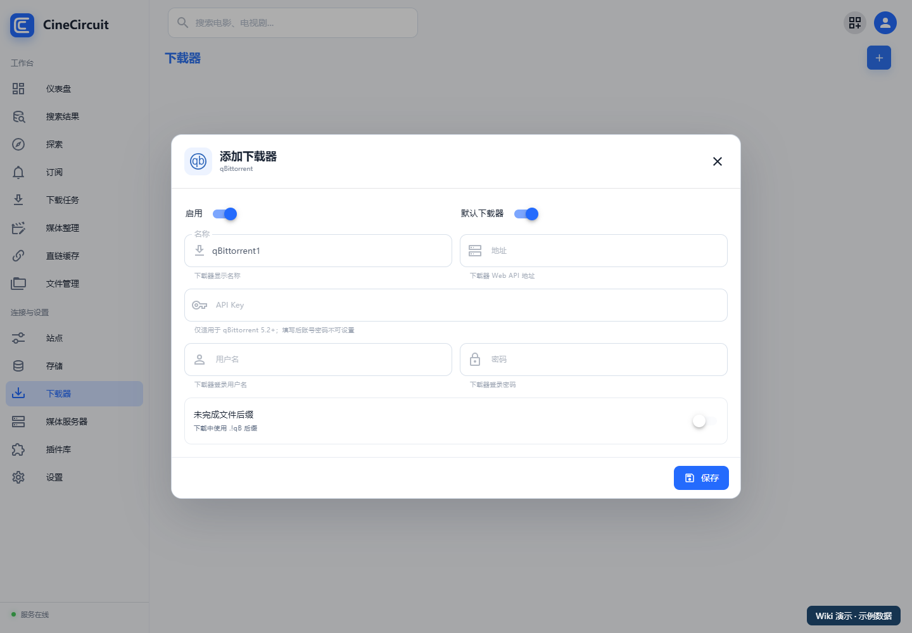

# 站点与下载器

[返回首页](../README.md)

已有媒体库、仅需要同步 STRM 的用户，可以跳过本章。

## 1. 先连接下载器

打开“**下载器**”，点击右上角添加按钮，选择下载器类型。

| 配置项 | 怎么填写 |
| --- | --- |
| 名称 | 例如“家庭下载器” |
| 地址 | CineCircuit 服务器能够访问的下载器 Web/API 地址，包含协议和端口 |
| 用户名、密码 / API Key | 按当前下载器接入页面显示的认证字段填写 |
| 启用 | 开启后参与工作流 |
| 默认下载器 | 需要作为默认目标时启用 |

保存后查看下载器卡片的连接状态。连接失败时检查地址、认证、下载器的 Web/API 开关及网络可达性。

## 2. 核对下载路径

下载器和 CineCircuit 可能是两个容器。同一份宿主机文件在两个容器内可能有不同路径。

例如，宿主机 `/srv/cinecircuit/media/downloads` 在 CineCircuit 中是 `/media/downloads`。配置整理监控时必须选择后者。下载器报告的路径若不同，应按界面支持的目录映射配置一致的对应关系；首次部署尽量让两边看到相同的路径。

先下载一个有权使用的小文件，确认 CineCircuit 能找到它，再开启下载完成后的自动处理。

## 3. 添加站点

1. 打开“**站点**”，在对应来源中添加站点。
2. 从可选目录选择正确站点，核对站点地址。
3. 按页面显示的认证方式填写 Cookie、API Key 或其他字段。
4. 需要 RSS 模式时，填写自己的完整 RSS 地址。
5. 选择下载器、优先级和超时时间。
6. 需要代理访问时开启对应选项，保存后查看连接或搜索结果。

| 字段 | 含义 |
| --- | --- |
| RSS 地址 | 此账号可用的订阅链接；可能含私有令牌 |
| 优先级 | 数值越小越优先 |
| 下载器 | 该站点资源使用的下载器 |
| 超时时间 | 站点请求允许等待的时间 |
| 使用代理访问 | 是否使用已配置的代理连接该站点 |

认证方式必须匹配所选站点的要求。部分站点使用 API Key，部分使用 Cookie 或其他认证方式，不能相互替代。具体字段以配置页面为准。

## 4. 试一次手动资源搜索

从顶部搜索框或影视详情的资源搜索入口发起搜索，在“**搜索结果**”查看返回资源。

核对影视名称、年份、季集、质量、大小和来源。确认资源与目标匹配后，再选择下载或转存。

没有结果时，先分辨是“来源没有返回资源”，还是“返回资源被规则过滤”。不要一次开启很多限制；先验证单个来源，再逐步加入画质、语言和优先级要求。

**下一步：[搜索与订阅](06-subscriptions.md)。**
