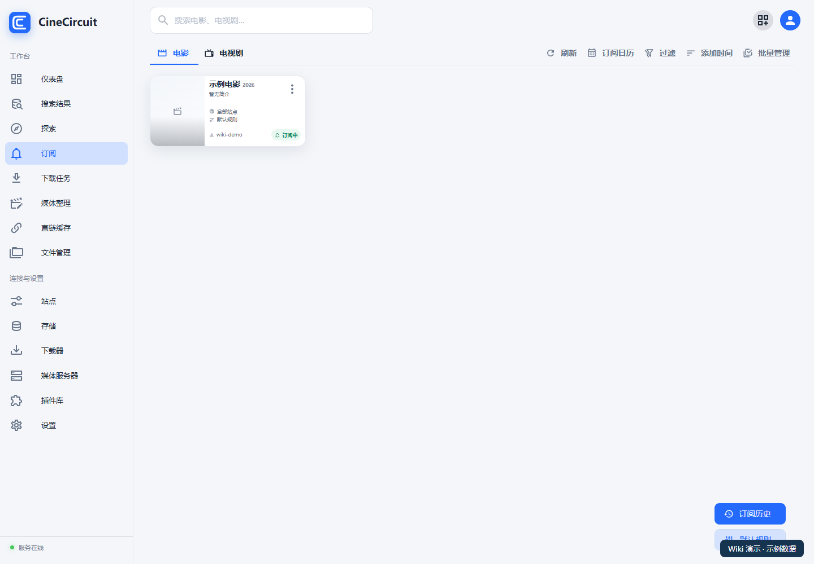

# 搜索与订阅

[返回首页](../README.md)

## 1. 找到正确的影视条目

1. 在顶部搜索框输入影视名称，或打开“**探索**”。
2. 打开影视详情，核对标题、年份和类型。
3. 电视剧应继续核对季与集数，避免把不同季度或同名作品混在一起。
4. 选择订阅操作；如出现来源选择或季集弹窗，按需要完成选择。

影视资料搜索用于确定“是哪部作品”；资源搜索用于查找“从哪里获取”。前者有结果，并不代表已配置来源一定能提供资源。

## 2. 配置订阅基础选项

打开“**设置 → 订阅**”：

- 配置站点订阅模式及 RSS 周期等可用选项。
- 选择订阅规则组。
- 启用需要的获取源，调整获取源顺序。
- 配置各来源的目标位置，并选择参与订阅搜索的站点。
- 保存相应区域。

目标取决于获取方式：站点种子通常交给下载器；网盘资源需要选择对应网盘账号与接收目录。要让后续自动整理生效，接收目录应与已经配置的整理来源一致。

## 3. 设置资源筛选规则

在“**设置 → 规则**”维护资源规则和优先级；在单条订阅中按需编辑该订阅的规则。

第一次订阅可先使用较宽松的条件，确认有匹配资源后，再增加分辨率、资源质量或其他要求。规则过严会导致“搜得到，但不选中”。

## 4. 管理订阅

打开侧栏“**订阅**”。

1. 用“**电影 / 电视剧**”页签切换类型。
2. 查看卡片状态，打开卡片菜单处理单条订阅。
3. 用过滤、排序定位需要处理的条目。
4. 点击“**批量管理**”选择多条订阅，再执行相应操作。
5. 使用“**订阅日历**”查看日历；使用“**订阅历史**”追踪已发生的处理。

修改规则后，核对来源和目标目录仍然有效；暂停订阅后，已提交给下载器或网盘的任务需在任务页单独检查。

## 5. 怎样确认一条订阅真正跑通

按下面的顺序检查，不要只看某一步的提交提示：

1. **匹配：**来源返回了正确作品及季集。
2. **获取：**下载器或网盘接受任务，并最终生成文件。
3. **整理：**文件进入正确媒体目录，识别信息正确。
4. **同步：**对应 STRM 与需要的元数据已生成。
5. **入库：**媒体服务器扫描到内容，并能播放。

“已排队”“等待网盘确认”都不是最终完成。远端状态不确定时，先检查原任务，避免重复提交。

**下一步：[整理与同步](07-organize-sync.md)。**
