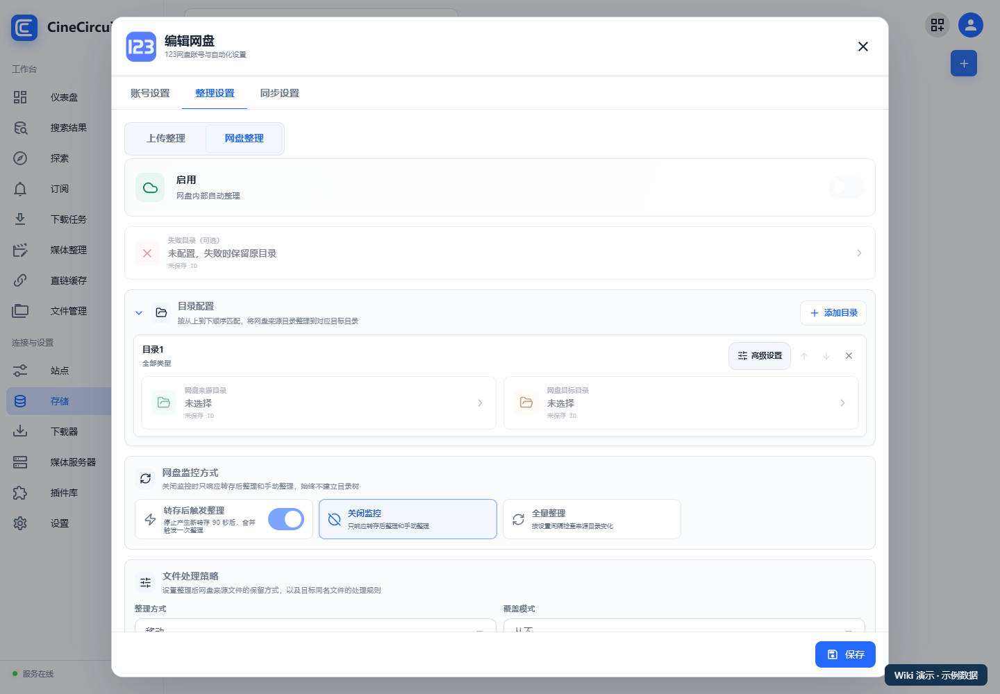
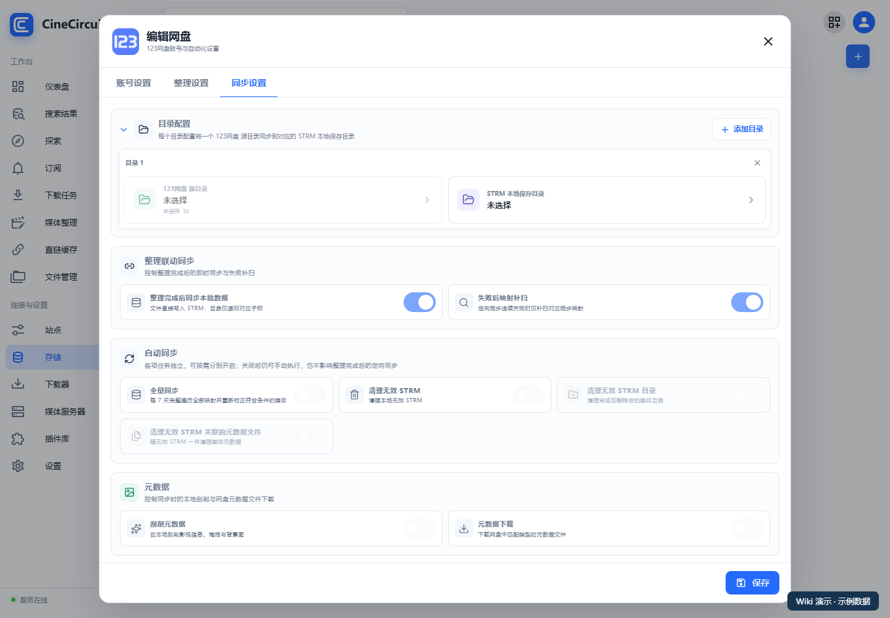

# 整理与 STRM 同步

[返回首页](../README.md)

**整理处理原媒体的位置和命名；同步把网盘媒体映射为本地 STRM。** 已有规范媒体库时，可以先只配置同步。

## 1. 先规划目录

本章使用以下示例：

```text
网盘
├── 待整理/       ← 下载、分享转存的接收位置
└── 媒体库/       ← 整理后的电影、电视剧

CineCircuit 容器
└── /media/strm/  ← 从网盘媒体库生成的 STRM
```

来源与目标要明确区分，避免来源包含目标造成反复扫描。先用小测试目录检查效果，再扩大到完整媒体库。

## 2. 配置网盘整理

打开“**存储 → 目标账号 → 整理设置**”，选择网盘整理相关区域。



1. 添加目录配置。
2. “**网盘来源目录**”选择 `/待整理`。
3. “**网盘目标目录**”选择 `/媒体库`。
4. 根据需要配置失败目录和目录的高级选项。
5. 检查整理方式及同名文件覆盖策略。
6. 保存后，再根据需要启用网盘整理及监控。

可选整理方式取决于网盘能力，不是所有网盘都支持盘内复制。选择移动整理会改变原文件位置，应先用测试文件确认。

## 3. 本地文件上传整理

同一整理设置中可以配置“**上传整理**”：

1. “**监控的本地目录**”选择容器可见的本地目录，例如 `/media/downloads`。
2. “**上传到网盘目录**”选择目标网盘目录。
3. 检查上传、整理和本地文件保留方式。
4. 保存，先用单个文件确认，再开启自动监控。

本地目录选择受已配置本地存储影响。找不到目录时先检查本地存储和容器挂载。

## 4. 配置同步映射

打开同一账号的“**同步设置**”。



| 字段 | 本例应填写 |
| --- | --- |
| 网盘源目录 | 选择整理后的 `/媒体库` |
| STRM 本地保存目录 | `/media/strm` |

可以添加多个目录配置，但各输出位置应清楚区分。只填了“STRM 直连地址”还不够，必须在这里配置同步来源与输出位置。

## 5. 跑一次全量同步

1. 保存目录映射。
2. 返回存储列表，在账号操作菜单中执行“**全量同步**”。
3. 查看同步任务结果，确认源目录被完整读取。
4. 在本地输出目录检查是否生成 `.strm`。
5. 打开一份 STRM，确认里面的地址指向你配置的 CineCircuit 地址。
6. 把输出目录交给媒体服务器扫描。

STRM 不包含视频，不能替代原媒体备份。原网盘文件被删除或账号失效时，STRM 仍可能存在，但无法播放。

## 6. 开启自动化

手动同步成功后，再按需求启用：

| 选项 | 适用场景 |
| --- | --- |
| 整理完成后同步本批数据 | 希望新整理内容尽快生成 STRM |
| 失败后映射补扫 | 定向同步连续失败后补扫相应映射 |
| 生活事件 | 115 支持时处理远端变化 |
| 增量同步 | 支持时定期对比目录差异 |
| 全量同步 | 定期遍历映射、校正媒体 |
| 清理无效 STRM | 删除已失效的本地链接；确认扫描和映射稳定后再开启 |

部分提供方只显示全量同步，不显示生活事件或增量同步。自动同步各开关独立，关闭定时任务不等于关闭整理完成后的定向同步。

“清理无效 STRM 目录”和关联元数据清理依赖无效 STRM 清理。首次配置建议先检查生成结果，再启用清理，避免因映射错误产生不符合预期的删除。

## 7. 处理整理失败

打开“**媒体整理**”，查看记录和整理详情：

1. 核对来源文件、存储、目标目录和错误信息。
2. 识别错误时，使用记录操作提供的“**手动整理**”修正影视身份和相关参数。
3. 目录或权限错误时，先修复配置，再重试。
4. 查看最终文件和同步记录，确认问题解决。

**下一步：[媒体服务器与播放](08-playback.md)。**
