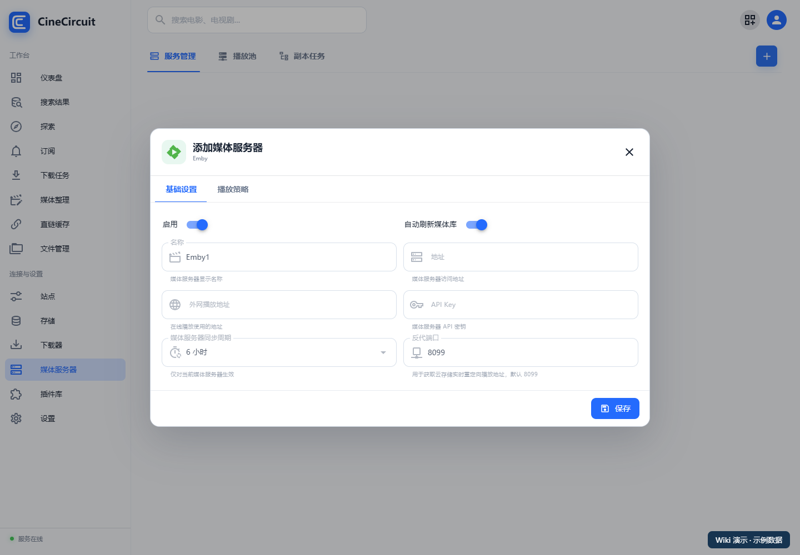
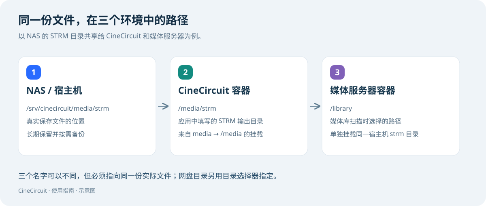

# 媒体服务器与播放

[返回首页](../README.md)

先完成[STRM 同步](07-organize-sync.md)，再接入媒体服务器。本文以 Emby 配置界面为例，其他类型按其实际字段填写。

## 1. 添加媒体服务器

打开“**媒体服务器**”，点击添加按钮，选择类型。

| 字段 | 怎么填 |
| --- | --- |
| 名称 | 例如“家庭影院” |
| 地址 | CineCircuit 能访问的媒体服务器地址 |
| 外网播放地址 | 客户端实际使用的外网入口；按自身部署填写 |
| API Key | 在相应媒体服务器中创建的 API 凭据 |
| 自动刷新媒体库 | 希望处理后自动触发刷新时启用 |
| 媒体服务器同步周期 | 按需要设置当前服务器的同步周期 |
| 反代端口 | 用于应用的媒体服务器反代入口，默认界面提示为 8099；多实例时避免冲突 |

保存后检查连接状态。这里的“地址”是上游媒体服务器地址，不是 CineCircuit 的 8000 端口。

## 2. 让媒体服务器看见 STRM

1. 将 STRM 所在的宿主机目录挂载给媒体服务器。
2. 在媒体服务器中创建或编辑媒体库。
3. 选择媒体服务器自己能看到的路径，按电影、电视剧组织媒体库。
4. 发起媒体库扫描，确认能找到同步出的内容。

例如，CineCircuit 的 `/media/strm` 与媒体服务器的 `/library` 可以指向同一个宿主机目录。它们不要求名字相同，但必须是同一份实际文件。

## 3. 先验证基础播放

1. 选一部已同步的媒体。
2. 确认 STRM 内的 CineCircuit 地址在实际请求方可达。
3. 在媒体服务器客户端中播放。
4. 检查能否起播和拖动进度，并观察应用日志。

播放可能使用直链跳转，也可能由服务器代理带必要请求头的请求，取决于提供方和配置。不要假设所有网盘或客户端都会直接 302。

## 4. 按需启用反代与用户策略

需要媒体服务器代理能力时，客户端使用你配置的反代入口；检查该端口或反向代理域名确实对客户端开放。不要把入口反向配置到自己，造成代理循环。

对于支持的存储，可在媒体服务器的播放策略中配置：

- 网盘类型与默认播放模式。
- 默认播放池及池中的已登录账号。
- 用户独立策略或专属账号。
- 无法识别用户时使用默认策略还是拒绝。
- 缺少副本时等待目标副本还是允许已有副本。

用户路由还受“**设置 → STRM → 启用用户播放路由**”控制。先在存储中完成账号绑定，再去策略中选择；不能假设所有网盘都有播放池或副本功能。

## 5. 区分这三个地址

| 地址 | 指向哪里 | 谁要能访问 |
| --- | --- | --- |
| STRM 直连地址 | CineCircuit 播放入口 | 实际请求 STRM URL 的服务器或播放器 |
| 媒体服务器地址 | Emby / Jellyfin / Plex 上游 | CineCircuit |
| 外网/反代播放入口 | 客户端使用的媒体服务入口 | 电视、手机等客户端 |

内网地址只能供对应内网使用。外网客户端需要可达的入口以及匹配的协议、域名和端口。

**遇到问题：[播放故障排查](10-faq.md)。**
